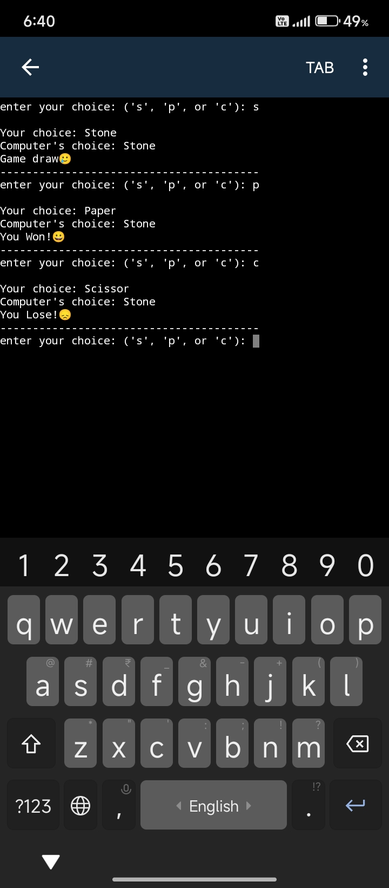

# Stone Paper Scissor Game - Python CLI Project

A fun and simple command-line Stone Paper Scissor game made using Python. This game allows a user to play against the computer using intuitive key inputs.

## Features
- Command-line interface (CLI)
- Randomized computer choices using `random` module
- Intuitive inputs: `'s'` for Stone, `'p'` for Paper, `'c'` for Scissor
- Clean result display (Win/Lose/Draw)
- Error handling for invalid inputs

## How to Play
- Run the script in any Python environment.
- When prompted, type:
  - `s` for Stone
  - `p` for Paper
  - `c` for Scissor
- The computer will randomly make a move.
- The result will be shown instantly!

## Game Logic
- Stone crushes Scissor
- Paper wraps Stone
- Scissor cuts Paper

## Screenshot

## Author
**Raunak Raj**  
[GitHub Profile](https://github.com/raunak-coder-2025)

## License
This project is open-source and free to use under the [MIT License](LICENSE).
